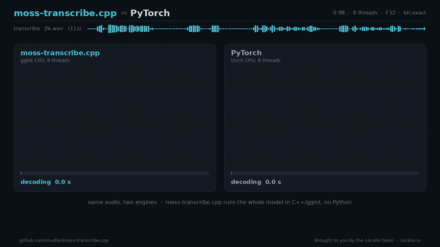
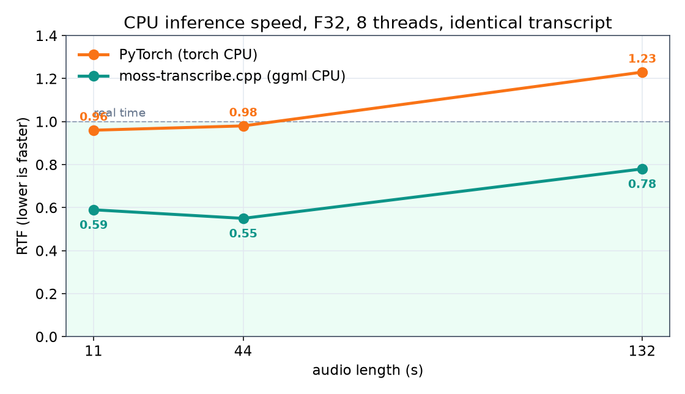
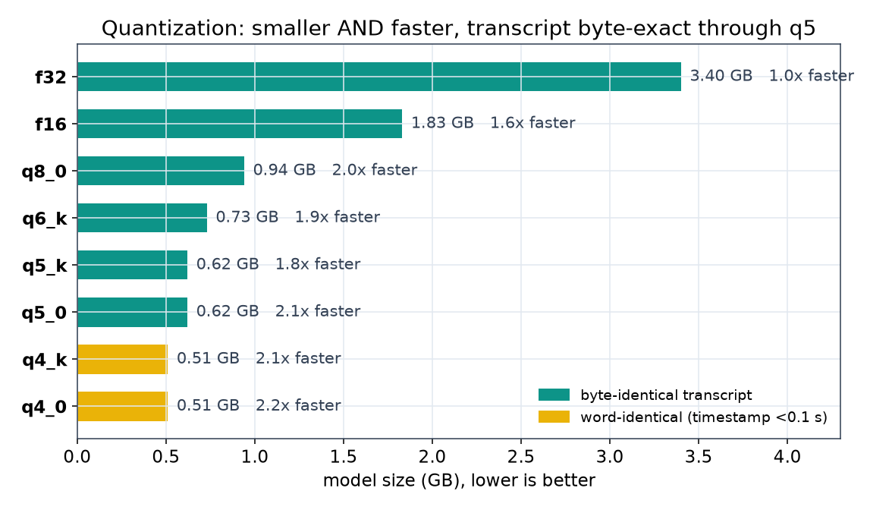

# moss-transcribe.cpp

**Brought to you by the [LocalAI](https://github.com/mudler/LocalAI) team**, the folks behind LocalAI, the open-source AI engine that runs any model (LLMs, vision, voice, image, video) on any hardware, no GPU required.

[](https://huggingface.co/mudler/moss-transcribe.cpp-gguf)
[](LICENSE)
[](https://github.com/mudler/LocalAI)

moss-transcribe.cpp is a from-scratch C++17 inference port of [OpenMOSS MOSS-Transcribe-Diarize](https://github.com/OpenMOSS/MOSS-Transcribe-Diarize), built on [ggml](https://github.com/ggml-org/ggml). It does joint long-form transcription, speaker diarization, and timestamping in a single pass, on CPU (and on GPU through ggml's backends), with no Python, PyTorch, or CUDA toolkit at inference time. Everything lives in one self-contained GGUF, and the output is bit-for-bit identical to the reference model: every component is validated at cosine 1.0 against the genuine PyTorch model, and the end-to-end transcript matches it exactly. On CPU it is about 1.8x faster than the reference PyTorch runtime on the same audio and threads.



> The same audio, side by side: the identical timestamped, speaker-labelled transcript, moss-transcribe.cpp (ggml CPU) gets there first, 1.6 to 1.8x faster than PyTorch and on about 1.5x less RAM ([full benchmarks](benchmarks/BENCHMARK.md), [square cut for social](benchmarks/media/moss_transcribe_race_square.gif)).

The model emits a compact, time-aligned, speaker-labelled transcript in one autoregressive stream, for example:

```text
[0.28][S01] And so, my fellow Americans, ask not what your country can do for you,[7.71][8.12][S02] ask what you can do for your country.[10.59]
```

Timestamps are in seconds, speakers are relative per-recording labels (`[S01]`, `[S02]`, and beyond) assigned in order of appearance. There is no separate ASR-plus-diarization pipeline: the model writes the speaker tags and times itself, and this port reproduces that stream token for token.

---

## What it is

MOSS-Transcribe-Diarize 0.9B is an end-to-end audio understanding model for multi-speaker transcription, diarization, and timestamps. moss-transcribe.cpp reimplements its full inference graph in ggml:

| Component | Specification |
|---|---|
| Audio encoder | Whisper-Medium encoder (24 layers, 80-mel, 30 s chunks) |
| Audio-text bridge | 4x temporal merge + MLP adaptor (VQAdaptor) |
| Text backbone | Qwen3-0.6B causal decoder (28 layers, GQA, QK-norm, NEOX RoPE) |
| Fusion | audio features replace `<|audio_pad|>` embeddings (masked_scatter) |
| Output | `[start][Sxx]text[end]` transcript with inline speaker tags and time markers |

Long audio is handled the same way the reference does it: split into 30 s chunks, encode each, concatenate, and interleave absolute-time markers into the audio token stream so the decoder can anchor timestamps across the whole recording.

---

## Performance

moss-transcribe.cpp is faster than the reference PyTorch runtime on CPU, on the same audio and the same thread budget, with a byte-identical transcript. Numbers below are a warm, isolated run on a 20-core x86 CPU at 8 threads (the sweet spot: the autoregressive decode is memory-bandwidth bound, so more than 8 threads does not help and 20 threads is slower than 8). RTF is processing-seconds over audio-seconds, so lower is faster and below 1.0 is faster than real time. "Inference" excludes the one-time model load (about 1.4 s for the mmap'd F32 GGUF).

| Audio | moss-transcribe.cpp | PyTorch (torch CPU) | Speedup |
| ----- | ------------------- | ------------------- | ------- |
| 11 s  | 6.5 s (RTF 0.59)    | 10.5 s (RTF 0.96)   | 1.62x   |
| 44 s  | 24.2 s (RTF 0.55)   | 43.0 s (RTF 0.98)   | 1.78x   |
| 132 s | 102.8 s (RTF 0.78)  | 162.1 s (RTF 1.23)  | 1.58x   |

Inference time (one-time model load excluded), warm run. Both engines emit the identical transcript. moss-transcribe.cpp stays under real time (RTF below 1.0) across the range; PyTorch crosses 1.0 by 132 s.



Two honest caveats:

- **RTF grows with audio length.** The decode is autoregressive over a context that grows with the audio (more audio tokens, a longer transcript), so per-second cost rises with duration. This is inherent to the model, and it affects the reference the same way. For hour-long audio on CPU you are looking at a long run for either engine, the reference model targets GPU (its published single-H100 numbers are RTF 0.02 to 0.12). GPU support here is on the roadmap (see below).
- **These are the F32 CPU numbers.** F16 and quantization (q8_0/q6_k/q5_k/q4_k) are available now and cut the model from 3.4 GB down to 511 MB with the transcript still byte-identical through q5_k (see [Quantization](#quantization)); the ggml GPU backends (CUDA, Metal, Vulkan) are the next milestone. The headline wins are correctness (bit-exact), portability (no Python/PyTorch/CUDA), a real CPU speedup over PyTorch, and now much smaller quantized models.

Full methodology and the reproducible harness are in [`benchmarks/BENCHMARK.md`](benchmarks/BENCHMARK.md).

---

## Build

Clone with submodules (ggml is vendored at `third_party/ggml`):

```sh
git clone --recursive https://github.com/mudler/moss-transcribe.cpp
cd moss-transcribe.cpp
cmake -B build -DMT_BUILD_TESTS=ON && cmake --build build -j
```

Use `-DGGML_NATIVE=OFF` for portable or CI builds. For the shared library (LocalAI / dlopen), build with `-DMT_SHARED=ON`.

### CMake options

| Option | Default | Purpose |
|---|---|---|
| `MT_BUILD_TESTS` | OFF | Compile and register ctest targets |
| `MT_BUILD_CLI` | ON | Build the `moss-transcribe` CLI |
| `MT_SHARED` | OFF | Build the library as a shared object |
| `MT_GGML_CUDA` | OFF | Forward GGML_CUDA to the submodule |
| `MT_GGML_METAL` | OFF | Forward GGML_METAL to the submodule |
| `MT_GGML_VULKAN` | OFF | Forward GGML_VULKAN to the submodule |
| `MT_GGML_HIP` | OFF | Forward GGML_HIP (ROCm) to the submodule |

To build for a GPU, forward its flag and rebuild, e.g. CUDA: `cmake -B build-cuda -DMT_GGML_CUDA=ON && cmake --build build-cuda -j` (Metal/Vulkan/HIP analogously). The backend auto-selects the GPU when present (`MTD_DEVICE=cpu` forces CPU). `scripts/gpu_verify.sh <gguf> <wav> [cuda|metal|vulkan|hip]` builds, checks the GPU transcript is byte-identical to CPU, and reports GPU vs CPU speed. GPU parity and benchmarks are validated on real hardware (a build machine with the ggml GPU toolchain).

---

## Get the model

Convert the HuggingFace checkpoint to a self-contained GGUF (needs a one-time Python environment for conversion only, never at inference):

```sh
python3 -m pip install -r scripts/requirements.txt
hf download OpenMOSS-Team/MOSS-Transcribe-Diarize --local-dir models/hf
python3 scripts/convert_moss_transcribe_to_gguf.py models/hf -o models/moss-transcribe-f32.gguf
```

The converter embeds everything the loader needs (all dims, the Whisper mel filterbank, the Qwen2 tokenizer, the time-marker parameters, the default prompt) as GGUF metadata and tensors. Nothing is hardcoded in the C++ and no sidecar config or vocab file is shipped.

### Quantization

The converter emits F32, F16, and q8_0 directly. The K-quants (q6_k/q5_k/q4_k), which the Python `gguf` writer cannot produce, come from the CLI `quantize` command against an F32 GGUF:

```sh
# F16 and q8_0 from the converter
python3 scripts/convert_moss_transcribe_to_gguf.py models/hf -o models/moss-transcribe-f16.gguf  --dtype f16
python3 scripts/convert_moss_transcribe_to_gguf.py models/hf -o models/moss-transcribe-q8_0.gguf --dtype q8_0

# K-quants (and q4_0/q5_0) from an F32 GGUF
./build/moss-transcribe quantize models/moss-transcribe-f32.gguf models/moss-transcribe-q6_k.gguf q6_k
./build/moss-transcribe quantize models/moss-transcribe-f32.gguf models/moss-transcribe-q5_k.gguf q5_k
./build/moss-transcribe quantize models/moss-transcribe-f32.gguf models/moss-transcribe-q4_k.gguf q4_k
```

Only the large `ggml_mul_mat`-fed weights are quantized (the Qwen3 and Whisper attention/FFN projections, the adaptor linears, and the token embedding, 343 tensors). Norms, biases, the conv stem, positional embeddings, and the mel filterbank stay F32. Size and accuracy on the JFK sample (CPU, greedy):

| dtype | size | vs f32 | wall (11 s, 8 threads) | speed vs f32 | transcript vs reference |
| ----- | ---- | ------ | ---------------------- | ------------ | ----------------------- |
| f32   | 3.4 GB | 100% | 7.83 s | 1.0x | byte-identical (the parity gate) |
| f16   | 1.8 GB | 50%  | 4.96 s | 1.6x | byte-identical |
| q8_0  | 942 MB | 27%  | 3.97 s | 2.0x | byte-identical |
| q6_k  | 733 MB | 21%  | 4.16 s | 1.9x | byte-identical |
| q5_k  | 619 MB | 18%  | 4.47 s | 1.8x | byte-identical |
| q5_0  | 619 MB | 18%  | 3.81 s | 2.1x | byte-identical |
| q4_k  | 511 MB | 15%  | 3.81 s | 2.1x | word-identical (one timestamp off 0.02 s) |
| q4_0  | 511 MB | 15%  | 3.57 s | 2.2x | word-identical (one timestamp off 0.07 s) |



Quantization is a **speed** win as well as a size win: the autoregressive decode is memory-bandwidth bound, so the smaller quantized weights run up to about 2.2x faster than F32 on CPU. F16 through q5_0 reproduce the reference transcript exactly (greedy argmax is robust to the small weight noise); q4_k/q4_0 are word-for-word identical with a hair of timestamp drift. Prebuilt GGUFs are published at [mudler/moss-transcribe.cpp-gguf](https://huggingface.co/mudler/moss-transcribe.cpp-gguf).

---

## Running inference

```sh
# Transcribe + diarize an audio file (wav, 16 kHz mono is loaded and resampled as needed)
./build/moss-transcribe transcribe models/moss-transcribe-f32.gguf audio.wav

# Cap the generated length (default comes from the GGUF)
./build/moss-transcribe transcribe models/moss-transcribe-f32.gguf audio.wav --max-new 4096

# Print model metadata (arch, dims, mel params, vocab size, time-marker settings)
./build/moss-transcribe info models/moss-transcribe-f32.gguf
```

The output is the raw model transcript, `[start][Sxx]text[end]` segments concatenated into one stream. Parsing it into structured `{start, end, speaker, text}` segments and exporting SRT/ASS/JSON subtitles (the speaker-aware post-processing the reference ships) is the next milestone.

Thread count defaults to all cores, which for this model is usually not optimal. Set `MTD_THREADS` to tune it (8 is a good default on a 20-core box); the decode is bandwidth bound, so fewer busy threads often beat more.

---

## Verification and parity

This is a parity-first port. Every component was gated numerically against tensors dumped from the genuine PyTorch model before the next was built, not just checked end to end:

| Stage | Gate |
|---|---|
| Whisper log-mel front end | cosine 1.0 vs `input_features` |
| Whisper encoder (24 layers) | cosine 1.0 vs `encoder_hidden` |
| Time-merge + VQAdaptor | cosine 1.0 vs `audio_embeds` (merge bit-exact) |
| Qwen2 tokenizer | decode matches the reference text exactly |
| Audio-span + time markers | `input_ids` bit-exact (single and multi-chunk) |
| Qwen3 decoder | cosine 1.0 vs `lm_hidden`, argmax match |
| masked_scatter fusion | bit-exact vs `fused_embeds` |
| Greedy decode | `generated_ids` bit-exact |
| **End to end (wav to text)** | **transcript equals the reference exactly** |

Run the suite (tests labelled `model` skip cleanly when the GGUF and baselines are absent):

```sh
export MTD_TEST_GGUF=models/moss-transcribe-f32.gguf
export MTD_TEST_BASELINE=tests/fixtures/baseline_short.gguf
export MTD_TEST_BASELINE_LONG=tests/fixtures/baseline_long.gguf
ctest --test-dir build -L model --output-on-failure
```

Baselines are produced from the authors' real model and processor with `scripts/gen_baseline.py`, and the CPU speed comparison against upstream PyTorch is `scripts/bench_upstream.py`.

---

## Use it from LocalAI

For a production deployment (an OpenAI-compatible `/v1/audio/transcriptions` endpoint, a model gallery, concurrency, auth, and metrics), use [LocalAI](https://localai.io), which is built to embed ggml engines like this one. A dedicated backend is on the roadmap below.

---

## Roadmap

- **Subtitle and diarization export.** Parse the transcript into `{start, end, speaker, text}` and export SRT/ASS/JSON with the speaker-aware merge and styling the reference ships.
- **GPU backends.** CUDA, Metal, and Vulkan through ggml, with the log-mel front end on-device. This is the path to fast hour-long transcription.
- **Flat C-API and LocalAI backend.** A `libmoss_transcribe.so` behind a stable C ABI, dlopened by a LocalAI `moss-transcribe-cpp` backend.

---

## Why moss-transcribe.cpp

The reference is a great model, but running it for inference drags in a heavy Python/PyTorch/transformers stack. moss-transcribe.cpp is a from-scratch C++17/ggml port focused purely on inference:

- **No Python at inference.** One self-contained GGUF and a small C++ binary (or, soon, a shared library behind a flat C API).
- **Bit-exact.** Component-level cosine 1.0 and an end-to-end transcript identical to the reference, proven against dumped reference tensors.
- **Faster on CPU** than the reference PyTorch runtime, on the same audio and threads.
- **Portable.** Runs on CPU today and on any ggml GPU backend as those land.

---

## Citation

If you use moss-transcribe.cpp, please cite this repository and the original model:

```bibtex
@software{moss_transcribe_cpp,
  title  = {moss-transcribe.cpp: a C++/ggml inference engine for MOSS-Transcribe-Diarize},
  author = {Di Giacinto, Ettore},
  url    = {https://github.com/mudler/moss-transcribe.cpp},
  year   = {2026}
}
```

MOSS-Transcribe-Diarize is by the [OpenMOSS / MOSI.AI team](https://github.com/OpenMOSS/MOSS-Transcribe-Diarize) (arXiv:2601.01554), released under Apache-2.0.

## Author

Ettore Di Giacinto ([@mudler](https://github.com/mudler)).

## License

moss-transcribe.cpp is released under the [MIT License](LICENSE). The MOSS-Transcribe-Diarize model weights keep their original Apache-2.0 license, check the model card on HuggingFace.

---

Built by the [LocalAI](https://github.com/mudler/LocalAI) team. If you want to run speech transcription and diarization (and LLMs, vision, voice, image, and video models) locally on any hardware with an OpenAI-compatible API, [give LocalAI a star](https://github.com/mudler/LocalAI).
