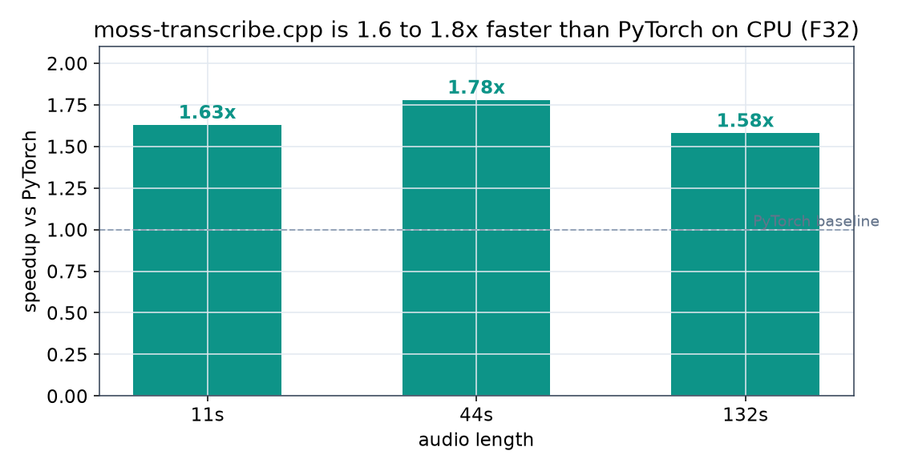

# Benchmarks

moss-transcribe.cpp vs the upstream MOSS-Transcribe-Diarize PyTorch runtime, on CPU, with byte-identical transcripts.

## Methodology

- **Same model, same audio, same threads.** Both engines run the same F32 weights on the same 20-core x86 CPU, capped at 8 threads (`MTD_THREADS=8` for ggml, `--threads 8` / `torch.set_num_threads(8)` for PyTorch). 8 is the measured sweet spot for this model: the autoregressive decode is memory-bandwidth bound, so more threads do not help, and 20 threads is slower than 8.
- **Warm and isolated.** The first (cold) run is discarded; the reported run is warm. Each configuration runs in its own process, one at a time, so there is no thermal carryover or core contention between measurements.
- **Inference excludes the one-time model load.** For moss-transcribe.cpp that load is about 1.4 s (mmap'd F32 GGUF); it is subtracted from the wall clock to get the inference number. The PyTorch number is the reference model's own `generate_transcription` call (feature extraction, encoder, and greedy decode), which likewise excludes the from_pretrained load.
- **RTF** is processing-seconds over audio-seconds. Lower is faster; below 1.0 is faster than real time.
- **Bit-exact check.** On every clip the two engines produce the identical transcript (this is verified in the parity test suite, and the transcripts printed by both benchmark harnesses match).

The upstream harness is [`scripts/bench_upstream.py`](../scripts/bench_upstream.py); the reference baselines are dumped by [`scripts/gen_baseline.py`](../scripts/gen_baseline.py). moss-transcribe.cpp is timed with the `transcribe` CLI subcommand.

Reproduce:

```sh
# ours (per length)
MTD_THREADS=8 ./build/moss-transcribe transcribe models/moss-transcribe-f32.gguf audio.wav

# upstream (same audio, same threads)
python3 scripts/bench_upstream.py models/hf audio.wav --threads 8 --warmup tests/fixtures/short.wav
```

## Results (20-core x86 CPU, 8 threads, F32)

| Audio | moss-transcribe.cpp (ggml) | PyTorch (torch CPU) | Speedup | Transcript |
| ----- | -------------------------- | ------------------- | ------- | ---------- |
| 11 s  | 6.5 s (RTF 0.59)           | 10.5 s (RTF 0.96)   | 1.62x   | identical  |
| 44 s  | 24.2 s (RTF 0.55)          | 43.0 s (RTF 0.98)   | 1.78x   | identical  |
| 132 s | 102.8 s (RTF 0.78)         | 162.1 s (RTF 1.23)  | 1.58x   | identical  |

Inference time excludes the one-time model load (about 1.4 s for the mmap'd F32 GGUF on our side; the PyTorch figure is the reference `generate_transcription` call). Both are F32 on the same 20-core x86 CPU at 8 threads, warm and isolated. Speedup is the PyTorch RTF over ours (equivalently, PyTorch inference time over ours).




## Notes

- **RTF grows with audio length** for both engines. The decode is autoregressive over a context that grows with the audio (more audio tokens plus a longer transcript, and attention cost grows with the sequence), so per-second cost rises with duration. moss-transcribe.cpp stays faster than PyTorch across the range, but neither is suited to hour-long audio on CPU. The reference model targets GPU (its published single-H100 figures are RTF 0.02 to 0.12); ggml GPU backends are on the roadmap.
- **Threads.** The win is largest around 8 threads. At 20 threads the same work is slower (bandwidth contention and thread-launch overhead dominate a decode that is not compute bound), which is why the default-all-cores setting is not optimal and `MTD_THREADS` is exposed.
- These are the **F32** numbers. Quantized GGUFs (F16, q8_0, q6_k, q5_k, q4_k) are available now via the converter and the CLI `quantize` command, cutting the model from 3.4 GB to as little as 511 MB with the transcript byte-identical through q5_k (q4_k is word-identical, one timestamp off by 0.02 s). See the [Quantization table](../README.md#quantization). GPU backends will cut time further.
